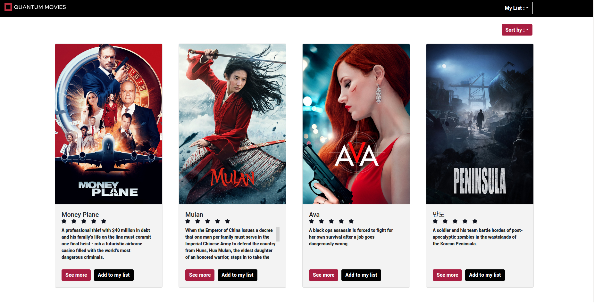

<br />
<p align="center">
  <a href="https://github.com/Thibault-collard/test-crossquantum">
    
  </a>

  <h3 align="center"> TEST LAFINBOX CROSSQUANTUM</h3>

  <p align="center">
    Test de candidature au poste de développeur Front-end chez CrossQuantum Lafinbox, une application mobile innovante qui permet de regrouper l'ensemble du patrimoine d'un particulier 
		<br />
    <br />
    <a href="https://test-crossquantum.herokuapp.com/">Voir la Demo</a>
    ·
    <a href="https://github.com/Thibault-collard/test-crossquantum/issues">Reporter un Bug</a>
    ·
    <a href="https://github.com/Thibault-collard/test-crossquantum/issues">Suggérer une amélioration</a>
  </p>
</p>

<!-- ABOUT THE PROJECT -->
## A propos du projet


L'Objectif de ce test est d'utiliser l'API Movie Database, afin de réaliser une interface utilisateur. 
https://developers.themoviedb.org/3/getting-started/introduction 

Fonctionnalités : 
- Utilisation obligatoire de Redux. 
- Affichage des derniers films: Un utilisateur peut voir les derniers films sur la page d'accueil. 
- Affichage dans des films dans l'ordre: Un utilisateur peut afficher les films par leur ordre de sortie. 
- Affichage d'un film sur une autre page: Un utilisateur peut alors voir tout les détails d'un film (vous êtes libre d'afficher le nombre d'informations que vous voulez). 
- Affichage les suggestions d'un film: Une fois sur la page de détails, un utilisateur peut voir les suggestions alternative en rapport avec ce film. 
- Creation d'une liste de film à voir: Un utilisateur peut se créer une liste de film à voir. Sauvegardé en LocalStorage 
- Ajout d'un système de rating: Un utilisateur peut ajouter une note sur chaque film. Sauvegardé en LocalStorage


### Construit avec

* Javascript ES6
* React
* Redux
* Html/CSS

<!-- GETTING STARTED -->
## Pour commencer ...

Pour naviguer sur le site internet, pas besoin d'identifiants, cliquez simplement sur ce lien : https://test-crossquantum.herokuapp.com

### Pré-requis

En plus d'avoir un environnement de programmation adéquat, il convient d'avoir des notions en Javascript, React & Redux pour bien appréhender ce projet

```

### Installation

1. Cloner le répertoire
```sh
git clone https://github.com/Thibault-collard/test-crossquantum.git
```
2. Installer les paquets NPM
```sh
npm install
```

<!-- USAGE EXAMPLES -->
## Compétences utilisés

- Accéder à une API externe et extraire des informations
- Utiliser Redux pour stocker des informations
- Gérer un affichage React dynamique 

<!-- ROADMAP -->
## Roadmap

- Accéder à l'API pour pouvoir trouver les informations nécessaires
- Stocker les données dans le store redux
- Y accéder à partir de la page d'affichage des films pour les afficher
- Modifier les informations et les propager dans le store redux et le composant
- Garantir un affichage constamment mis à jour des informations

<!-- LICENSE -->
## Licence

Ce dossier et l'ensemble du code qu'il contient est accessible gratuitement, sans besoin d'attribution.
Mais n'oubliez pas que recopier sans comprendre ne fera pas progresser vos compétences.

<!-- CONTACT -->
## Contact

Pour toutes demandes : thibault.collard@gmail.com


